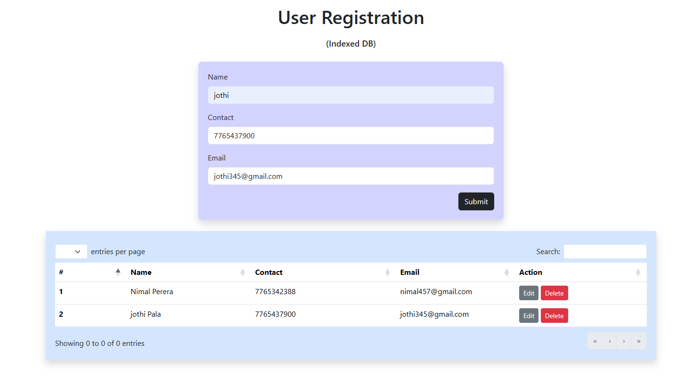
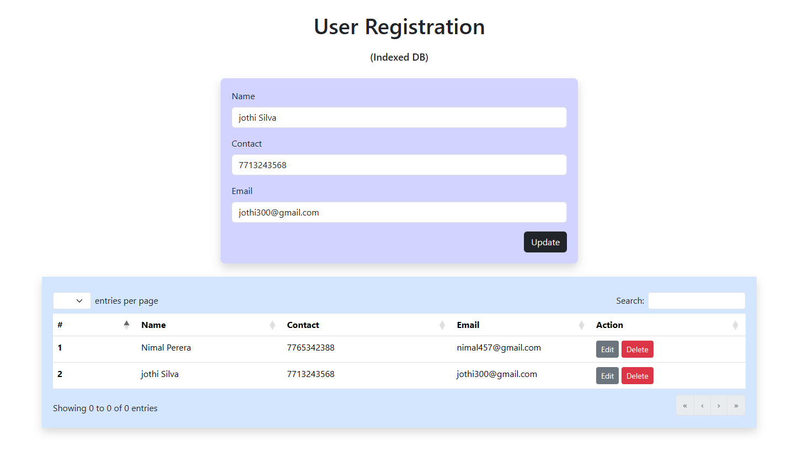

<p align="center"><a href="https://laravel.com" target="_blank"></a></p>

Clone these file to the XAMPP server

```
 git clone https://github.com/ashain760/lawn-care-app.git
```

## API 

#### Laravel 11 latest PHP Framework (php version 8)

- after clone run these commands
```
composer install
```
- create a `.env` file from `.env.example`
- Add your database connection in .env file
```
DB_CONNECTION=mysql
DB_HOST=127.0.0.1
DB_PORT=3306
DB_DATABASE=order-db
DB_USERNAME=root
DB_PASSWORD=root
```
- create a database in phpmyadmin
```
CREATE DATABASE `order-db`;
```
- after that run following commands
```
php artisan migrate:fresh --seed
php artisan passport:client --personal
```
- after that run the laravel api => http://127.0.0.1:8000/
```
php artisan serve
```

#### How to use

- Login to get access token

```
http://127.0.0.1:8000/api/v1/authenticate/login
{
    "email":"ashain760@gmail.com",
    "password":"Aa1#bcde"
}
```

- Start queue worker on CMD
```
php artisan queue:work
```

- Run this API to send order information to the `https://wibip.free.beeceptor.com/order` through queue job
```
http://127.0.0.1:8000/api/v1/orders
{
    "customer_name":"John Bass",
    "order_value":520
}
```
##### Indexed DB 
To view index db interface
```
http://127.0.0.1:8000/
```





##### Postman Collection 

```

```

or `public/backups` folder include postman collection and database

